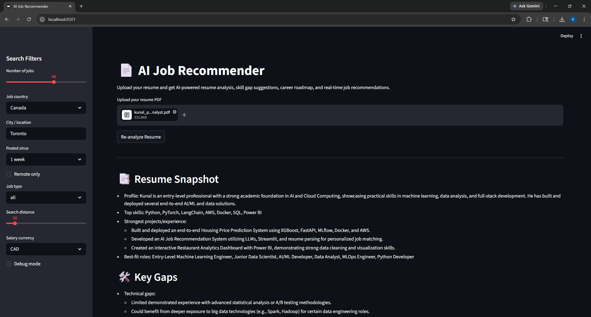
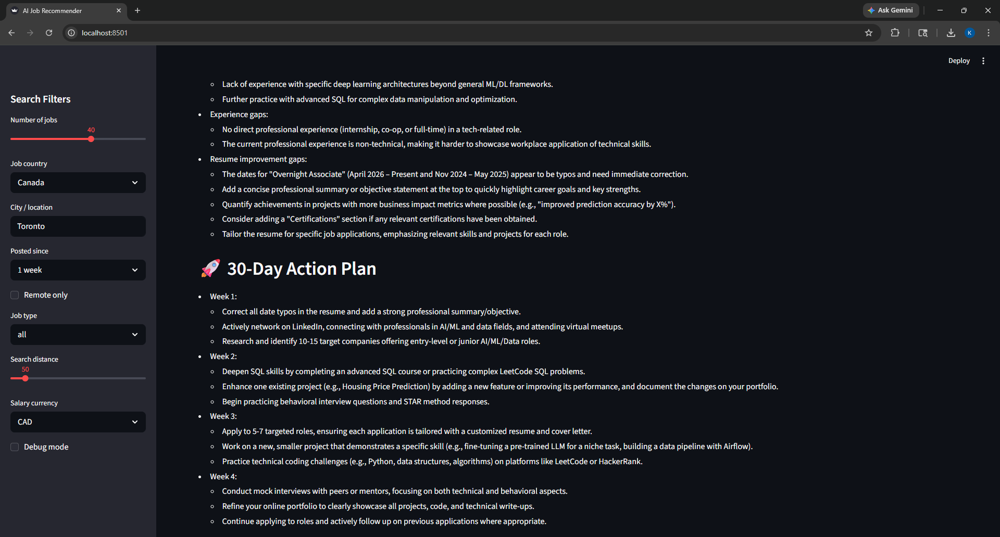
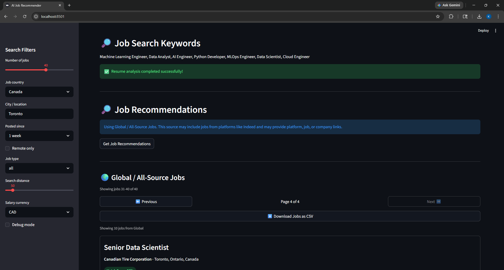
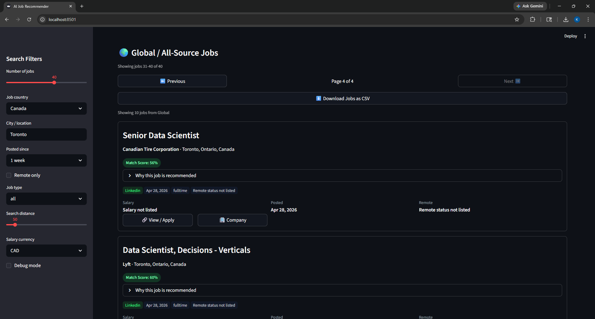
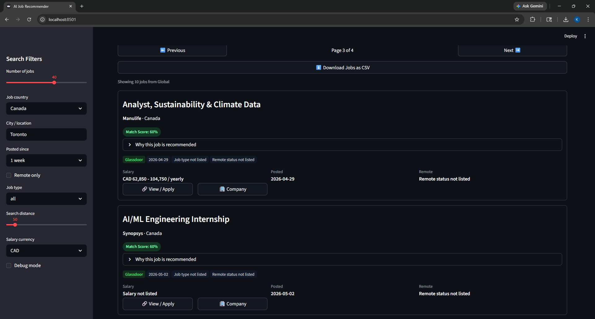
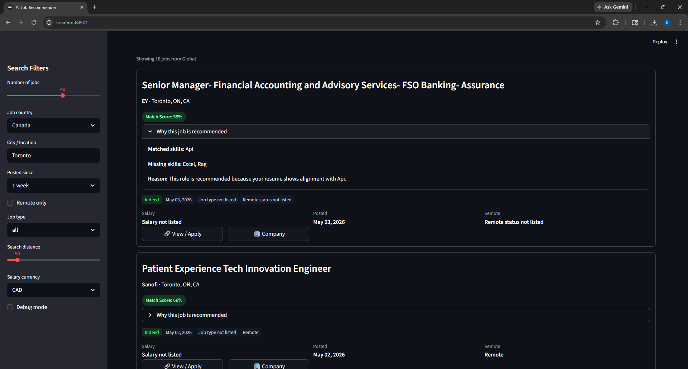

# AI Job Recommender

[](#tech-stack)
[](#tech-stack)
[](#deployment)
[](#tech-stack)
[](#cicd)

AI Job Recommender is a deployed AI-powered career assistant that analyzes a resume PDF, identifies strengths and skill gaps, generates a personalized 30-day roadmap, and recommends real-time jobs using external job data.

The app uses **Gemini on Vertex AI** for resume analysis, **Apify Global / All-Source Jobs** for real-time job fetching, and a rule-based recommendation layer to show match scores, matched skills, missing skills, and clear explanations for why each job is recommended.

---

## Live Demo

**Deployed app:**  
https://ai-job-recommender-778318657000.us-central1.run.app

> Note: The deployed demo uses a free/trial Apify account. If Apify credits are exhausted, resume analysis may still work, but real-time job recommendations may fail or return limited results until the quota resets or more credits are added.

---

## Table of Contents

- [Features](#features)
- [Tech Stack](#tech-stack)
- [Project Architecture](#project-architecture)
- [How It Works](#how-it-works)
- [Screenshots](#screenshots)
- [Project Structure](#project-structure)
- [Environment Variables](#environment-variables)
- [Local Setup](#local-setup)
- [Deployment](#deployment)
- [CI/CD](#cicd)
- [Portfolio Highlights](#portfolio-highlights)
- [Current Limitations](#current-limitations)
- [Future Improvements](#future-improvements)
- [Disclaimer](#disclaimer)

---

## Features

- Upload a resume PDF
- Extract resume text using PyMuPDF
- Analyze resumes using Gemini on Vertex AI
- Generate a resume snapshot, strengths, skill gaps, best-fit roles, and job-search keywords
- Generate a personalized 30-day career roadmap
- Fetch real-time job listings using Apify Global / All-Source Jobs
- Display job title, company, location, salary, remote status, posted date, and job links
- Calculate a match score for each job
- Show matched skills and missing skills
- Explain why each job is recommended
- Paginate job recommendation results
- Export job recommendations to CSV
- Debug raw API responses during development
- Deploy to Google Cloud Run
- Automate deployment using GitHub Actions CI/CD

---

## Tech Stack

| Area                   | Tools                          |
| ---------------------- | ------------------------------ |
| Language               | Python                         |
| UI                     | Streamlit                      |
| LLM                    | Gemini on Vertex AI            |
| Cloud                  | Google Cloud Run               |
| Job Data               | Apify Global / All-Source Jobs |
| PDF Parsing            | PyMuPDF                        |
| Data Processing        | Pandas                         |
| Environment Management | python-dotenv                  |
| Secrets                | Google Secret Manager          |
| CI/CD                  | GitHub Actions                 |
| Containerization       | Docker                         |

---

## Project Architecture

```text
Resume PDF Upload
        ↓
Text Extraction with PyMuPDF
        ↓
Resume Analysis with Gemini / Vertex AI
        ↓
Resume Snapshot + Skill Gaps + 30-Day Roadmap
        ↓
Job Keyword Extraction
        ↓
Real-Time Job Fetching with Apify
        ↓
Rule-Based Recommendation Layer
        ↓
Match Score + Matched Skills + Missing Skills + Explanation
        ↓
Streamlit UI + Pagination + CSV Export
        ↓
Cloud Run Deployment + GitHub Actions CI/CD
```

---

## How It Works

### 1. Resume Upload

The user uploads a resume PDF through the Streamlit interface.

### 2. Resume Text Extraction

The app uses PyMuPDF to extract raw text from the uploaded PDF resume.

### 3. Resume Analysis with Gemini

Gemini on Vertex AI analyzes the extracted resume text and generates a career-readiness report containing:

- Resume snapshot
- Top skills
- Strongest projects or experience
- Best-fit job roles
- Key skill gaps
- 30-day action plan
- Job-search keywords

### 4. Job Fetching

The extracted job-search keywords are sent to the Apify Global / All-Source Jobs actor. The app fetches real-time jobs using filters such as:

- Country
- City / location
- Posted date
- Remote-only preference
- Job type
- Distance
- Currency

### 5. Recommendation Layer

The app compares skills found in the resume analysis with skills and attributes found in job data. It then calculates:

- Match score
- Matched skills
- Missing skills
- Recommendation reason

### 6. CSV Export

Fetched job results are normalized into a clean table and can be downloaded as a CSV file.

---

## Screenshots

### Resume Analysis






### Job Recommendations









### CSV Export


---

## Project Structure

```text
AI-Job-Recommender-System/
│
├── app.py
├── Dockerfile
├── .dockerignore
├── .gitignore
├── requirements.txt
├── README.md
├── .env.example
│
├── screenshots/
│   ├── resume-analysis1.png
│   ├── resume-analysis2.png
│   ├── resume-analysis3.png
│   ├── job-recommendations1.png
│   ├── job-recommendations2.png
│   ├── job-recommendations3.png
│   ├── job-recommendations4.png
│   └── csv-export.png
│
└── src/
    ├── __init__.py
    ├── api_job.py
    ├── constant.py
    ├── helper.py
    ├── helper_gemini.py
    ├── prompts.py
    └── recommender.py
```

---

## Environment Variables

Create a `.env` file locally:

```env
APIFY_API_TOKEN=your_apify_token_here
GLOBAL_JOBS_ACTOR_ID=your_global_jobs_actor_id_here

GEMINI_BACKEND=vertex
GOOGLE_CLOUD_PROJECT=your_google_cloud_project_id
GOOGLE_CLOUD_LOCATION=us-central1
GEMINI_MODEL=gemini-2.5-flash
```

Do not push `.env` to GitHub. Use `.env.example` for placeholder values.

Example `.env.example`:

```env
APIFY_API_TOKEN=your_apify_token_here
GLOBAL_JOBS_ACTOR_ID=your_global_jobs_actor_id_here

GEMINI_BACKEND=vertex
GOOGLE_CLOUD_PROJECT=your_google_cloud_project_id
GOOGLE_CLOUD_LOCATION=us-central1
GEMINI_MODEL=gemini-2.5-flash
```

---

## Local Setup

### 1. Clone the Repository

```bash
git clone https://github.com/kpkp95/JobRecommender.git
cd JobRecommender
```

### 2. Create a Virtual Environment

Windows:

```bash
python -m venv .venv
.venv\Scripts\activate
```

macOS/Linux:

```bash
python -m venv .venv
source .venv/bin/activate
```

### 3. Install Dependencies

```bash
pip install -r requirements.txt
```

### 4. Authenticate with Google Cloud

For local Vertex AI usage:

```bash
gcloud auth application-default login
gcloud config set project your_google_cloud_project_id
```

### 5. Run the App

```bash
streamlit run app.py
```

---

## Deployment

This project is deployed on **Google Cloud Run** using Docker and environment variables managed through Google Cloud.

### Required Google Cloud APIs

```bash
gcloud services enable run.googleapis.com
gcloud services enable cloudbuild.googleapis.com
gcloud services enable artifactregistry.googleapis.com
gcloud services enable aiplatform.googleapis.com
gcloud services enable secretmanager.googleapis.com
```

### Create a Cloud Run Service Account

```bash
gcloud iam service-accounts create ai-job-recommender-sa \
  --display-name="AI Job Recommender Cloud Run Service Account"
```

### Grant Vertex AI Access

```bash
gcloud projects add-iam-policy-binding your_project_id \
  --member="serviceAccount:ai-job-recommender-sa@your_project_id.iam.gserviceaccount.com" \
  --role="roles/aiplatform.user"
```

### Store Apify Token in Secret Manager

```bash
echo "your_apify_token_here" | gcloud secrets create APIFY_API_TOKEN --data-file=-
```

Grant Cloud Run access to the secret:

```bash
gcloud secrets add-iam-policy-binding APIFY_API_TOKEN \
  --member="serviceAccount:ai-job-recommender-sa@your_project_id.iam.gserviceaccount.com" \
  --role="roles/secretmanager.secretAccessor"
```

### Deploy to Cloud Run

```bash
gcloud run deploy ai-job-recommender \
  --source . \
  --region us-central1 \
  --service-account ai-job-recommender-sa@your_project_id.iam.gserviceaccount.com \
  --allow-unauthenticated \
  --set-env-vars GOOGLE_CLOUD_PROJECT=your_project_id,GOOGLE_CLOUD_LOCATION=us-central1,GEMINI_MODEL=gemini-2.5-flash,GLOBAL_JOBS_ACTOR_ID=your_actor_id \
  --set-secrets APIFY_API_TOKEN=APIFY_API_TOKEN:latest
```

---

## CI/CD

This project uses **GitHub Actions** to automate deployment to Google Cloud Run.

Typical workflow:

```text
Push code to GitHub
        ↓
GitHub Actions workflow starts
        ↓
Authenticate with Google Cloud
        ↓
Build container image
        ↓
Deploy updated app to Cloud Run
```

This allows every approved update pushed to the deployment branch to be automatically redeployed without manually running Cloud Run deployment commands.

---

## Portfolio Highlights

This project demonstrates:

- Building an end-to-end AI product from resume upload to job recommendation
- LLM integration using Gemini on Vertex AI
- Resume parsing and prompt engineering
- Real-time external API integration with Apify
- Rule-based recommendation logic
- Match scoring and explainable job recommendations
- CSV export and pagination
- Streamlit UI development
- Cloud deployment using Google Cloud Run
- Secret management using Google Secret Manager
- GitHub Actions CI/CD for automated deployment
- Practical error handling for external API limits and missing job data

---

## Current Limitations

- Match scoring is currently rule-based, not semantic.
- Job data depends on the availability and limits of the external Apify actor.
- The deployed demo uses limited Apify free/trial credits, so job fetching may stop working temporarily if the quota is exhausted.
- Some jobs may not include direct application links or complete salary information.
- Resume analysis quality depends on PDF text extraction quality.
- The app does not currently include user authentication or saved job tracking.

---

## Future Improvements

- Add semantic job matching using embeddings
- Add resume optimization for a selected job description
- Add AI-generated cover letter support
- Add saved jobs and application tracking
- Add database storage for user sessions and saved recommendations
- Add MCP tools so external AI clients can call the job search system
- Add analytics dashboard for job-match trends
- Improve UI styling and mobile responsiveness

---

## Disclaimer

This project is for educational and portfolio demonstration purposes. Job data is fetched from external APIs, so availability, completeness, formatting, and accuracy may vary depending on the external data source.
